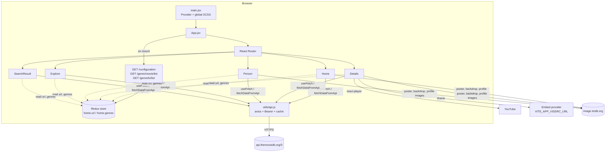

# Movix — Project Documentation

> A responsive movie and TV discovery web app built with **React 18**, **Redux Toolkit**, **Vite** and **SASS**, powered by the **TMDB (The Movie Database) API**.

This is the full technical reference for the codebase: what the app does, how it is wired together, how it talks to TMDB, how it is styled, and what to watch out for. For a short intro and screenshots, see [`README.md`](./README.md).

| | |
|---|---|
| **Repository** | https://github.com/satish-kumar75/Movix |
| **Package name** | `movix` (private, v0.0.0) |
| **Module system** | ES modules (`"type": "module"`) |
| **Dev server** | `npm run dev` → http://localhost:5173 (`vite --host`, also reachable on your LAN) |
| **Deploy target** | Vercel (`vercel.json` SPA rewrite) |

---

## Table of contents

1. [What the app does](#1-what-the-app-does)
2. [Tech stack](#2-tech-stack)
3. [Getting started](#3-getting-started)
4. [Environment variables](#4-environment-variables)
5. [Project structure](#5-project-structure)
6. [Architecture](#6-architecture)
7. [Routing](#7-routing)
8. [TMDB API integration](#8-tmdb-api-integration)
9. [State management](#9-state-management)
10. [Pages and components](#10-pages-and-components)
11. [Video playback](#11-video-playback)
12. [Design system](#12-design-system)
13. [Scripts, linting and deployment](#13-scripts-linting-and-deployment)
14. [Known issues and recommended fixes](#14-known-issues-and-recommended-fixes)
15. [Roadmap ideas](#15-roadmap-ideas)
16. [Credits and legal](#16-credits-and-legal)

---

## 1. What the app does

Movix lets a visitor browse, search and explore movies, TV shows and the people who make them. There is no login, no backend and no database: everything is read live from TMDB in the browser.

| Capability | Where it lives |
|---|---|
| Hero banner of **upcoming movies** with a clickable poster strip | `pages/home/heroBanner` |
| **Trending** (day / week), **What's Popular** and **Top Rated** (movies / TV) carousels | `pages/home/*` |
| **Details page** for a movie or TV show: backdrop, poster, tagline, genres, rating, overview, status, release date, runtime, director, writers, creators | `pages/details` |
| **Top cast** → click a cast member to open their **person page** | `pages/details/cast`, `pages/person` |
| **Official videos** (trailers, teasers, clips) played in a modal | `pages/details/VideosSection` |
| **Similar** titles and **Recommendations** carousels | `pages/details/carousels` |
| **Person page**: photo, biography with read more / less, birth date and place, known-for department, aliases, social links, acting and production credits | `pages/person` |
| **Explore** movies or TV with genre multi-select, sorting and **infinite scroll** | `pages/explore` |
| **Search** across movies and TV (multi-search) with infinite scroll | `pages/searchResult` |
| Skeleton loaders, lazy-loaded blurred images, hide-on-scroll header, mobile menu | `components/*` |

---

## 2. Tech stack

| Layer | Library | Version | Role |
|---|---|---|---|
| UI | `react`, `react-dom` | ^18.2.0 | Component rendering (`createRoot`) |
| Routing | `react-router-dom` | ^6.6.2 | Client-side routes (`BrowserRouter`) |
| State | `@reduxjs/toolkit`, `react-redux` | ^1.9.1, ^8.0.5 | Global store for image base URLs and genres |
| HTTP | `axios` | ^1.2.2 | TMDB requests |
| Styling | `sass` | ^1.57.1 | SCSS per component, shared mixins |
| Dates | `dayjs` | ^1.11.7 | Date formatting |
| Select | `react-select` | ^5.7.0 | Genre and sort dropdowns on Explore |
| Infinite scroll | `react-infinite-scroll-component` | ^6.1.0 | Explore and Search lists |
| Images | `react-lazy-load-image-component` | ^1.5.6 | Lazy loading with blur effect |
| Rating ring | `react-circular-progressbar` | ^2.1.0 | Circular vote-average badge |
| Video | `react-player` | ^2.11.0 | YouTube trailer playback |
| Icons | `react-icons` | ^4.7.1 | Search, menu, arrows, social icons |
| Build | `vite`, `@vitejs/plugin-react` | ^5.2.0, ^4.2.1 | Dev server and bundler |
| Lint | `eslint` 8 + react, react-hooks, react-refresh plugins | | `npm run lint` (zero warnings allowed) |

---

## 3. Getting started

**Prerequisites:** Git, Node.js (18 or newer recommended for Vite 5) and npm.

```bash
git clone https://github.com/satish-kumar75/Movix.git
cd Movix
npm install
```

Create your environment file (see [section 4](#4-environment-variables)), then:

```bash
npm run dev       # start Vite dev server with HMR
npm run build     # production build into dist/
npm run preview   # serve the production build locally
npm run lint      # ESLint over .js/.jsx, fails on any warning
```

### Getting a TMDB token

1. Create a free account at https://www.themoviedb.org.
2. Open **Settings → API** and request a developer key.
3. Copy the **API Read Access Token** (the long JWT, not the short v3 API key). Movix sends it as a `Bearer` token.

---

## 4. Environment variables

Vite only exposes variables prefixed with `VITE_` to client code, read through `import.meta.env`.

| Variable | Used in | Purpose |
|---|---|---|
| `VITE_APP_TMDB_TOKEN` | `src/utils/api.js` | TMDB v4 **Read Access Token**, sent as `Authorization: Bearer <token>` |
| `VITE_APP_VIDSRC_URL` | `src/components/vidSrcPlayer/VidSrcPlayer.jsx` | Base URL of the third-party embed player; the iframe `src` is `${VITE_APP_VIDSRC_URL}/${mediaType}/${tmdbId}` |

Example `.env` (use your own values; never commit real secrets):

```env
VITE_APP_TMDB_TOKEN=<your TMDB read access token>
VITE_APP_VIDSRC_URL=<base URL of the embed provider>
```

> ⚠️ **Security:** in the current repository `.env` is **tracked by git** and `.gitignore` does not list it. See [section 14](#14-known-issues-and-recommended-fixes), item 1. Also note that any `VITE_` variable is compiled into the public JavaScript bundle, so the TMDB token is visible to anyone who opens dev tools on the deployed site.

On Vercel, set both variables under **Project → Settings → Environment Variables** and redeploy.

---

## 5. Project structure

```
Movix/
├── index.html                 # Vite entry HTML, mounts #root, favicon = /movix-logo.png
├── vite.config.js             # Vite + @vitejs/plugin-react (no custom config)
├── vercel.json                # SPA fallback: every path rewrites to "/"
├── .eslintrc.cjs              # ESLint (recommended + react + hooks + refresh)
├── package.json
├── public/
│   ├── banner.png             # README banner
│   └── movix-logo.png         # Favicon
└── src/
    ├── main.jsx               # ReactDOM root, <Provider store>, global SCSS
    ├── App.jsx                # Boots TMDB config + genres, declares all routes
    ├── index.scss             # CSS variables, reset, .skeleton shimmer
    ├── mixins.scss            # Breakpoint mixins (sm…xxl) and ellipsis()
    ├── assets/                # logo (svg/png), avatar.png, no-poster.png, no-results.png
    ├── hooks/
    │   └── useFetch.jsx       # { data, loading, error } wrapper around fetchDataFromApi
    ├── utils/
    │   └── api.js             # Axios + Bearer auth + in-memory response cache
    ├── store/
    │   ├── store.js           # configureStore({ home })
    │   └── homeSlice.js       # url (image base URLs) + genres lookup
    ├── components/            # Reusable UI (each has its own style.scss)
    │   ├── carousel/          # Horizontal poster rail with arrows and skeletons
    │   ├── circleRating/      # Circular vote_average badge
    │   ├── contentWrapper/    # Centered 1200px container
    │   ├── footer/            # Footer (static)
    │   ├── genres/            # Genre chips from the Redux genre map (file: Geners.jsx)
    │   ├── header/            # Sticky header, search bar, mobile menu
    │   ├── lazyLoadImage/     #  with blur-up lazy loading
    │   ├── moiveCard/         # Poster card used in grids (folder/file: "moive")
    │   ├── spinner/           # Loading spinner
    │   ├── switchTabs/        # Animated two-way tab switch
    │   ├── videoPopup/        # YouTube modal (react-player)
    │   └── vidSrcPlayer/      # Iframe modal for the embed player
    └── pages/
        ├── home/              # Home, heroBanner, trending, popular, topRated
        ├── details/           # Details, detailsBanner, cast, VideosSection, carousels/, PlayIcon
        ├── person/            # Person, personDetails, carousels/
        ├── explore/           # Explore (filters + infinite scroll)
        ├── searchResult/      # SearchResult (multi-search + infinite scroll)
        └── 404/               # PageNotFound (currently an empty placeholder)
```

Conventions: one folder per component or page, with the JSX file and a `style.scss` next to it; components import their own styles.

---

## 6. Architecture



**Boot sequence**

1. `main.jsx` renders `<App />` inside the Redux `<Provider>`.
2. `App.jsx` runs once on mount:
   - `fetchApiConfig()` calls `/configuration` and stores `images.secure_base_url + "original"` as the base for **backdrop**, **poster** and **profile** images.
   - `generesCall()` fetches `/genre/movie/list` and `/genre/tv/list` in parallel and merges them into one `{ [genreId]: { id, name } }` map.
3. Every image component prepends `state.home.url.*` to the path TMDB returns; every genre chip looks up its name in `state.home.genres`.

**Data-fetching patterns**

- **Declarative, read-only data:** `useFetch(url)` in a component (home rails, details, cast, videos, similar, recommendations, person).
- **Imperative, paginated data:** call `fetchDataFromApi(url, params)` directly and manage `data`, `pageNum`, `loading` in component state (Explore, SearchResult).

---

## 7. Routing

Defined in `src/App.jsx`. `Header` and `Footer` render around every route; the header scrolls the window to the top on every location change.

| Path | Component | Notes |
|---|---|---|
| `/` | `Home` | Hero banner, Trending, Popular, Top Rated |
| `/:mediaType/:id` | `Details` | `mediaType` is `movie` or `tv`; `id` is the TMDB id |
| `/search/:query` | `SearchResult` | Multi-search; people are filtered out of the grid |
| `/explore/:mediaType` | `Explore` | `movie` or `tv` |
| `/person/:personId` | `Person` | Bio, socials, credits |
| `*` | `PageNotFound` | Renders an empty `<div>` today |

`vercel.json` rewrites every path to `/` so deep links and refreshes work on Vercel:

```json
{ "rewrites": [{ "source": "/(.*)", "destination": "/" }] }
```

> Route order matters: `/:mediaType/:id` is declared before `/search/:query`, and React Router v6 ranks static segments higher, so `/search/avatar` still reaches the search page. Still, a request such as `/foo/123` is treated as a details page and will show an empty result, not the 404 page.

---

## 8. TMDB API integration

### 8.1 Client (`src/utils/api.js`)

```js
const BASE_URL = "https://api.themoviedb.org/3";
const TMBD_TOKEN = import.meta.env.VITE_APP_TMDB_TOKEN;
const headers = { Authorization: "Bearer " + TMBD_TOKEN };
```

- One exported function: `fetchDataFromApi(url, params)` → `axios.get(BASE_URL + url, { headers, params })`, returns `response.data`.
- **Caching:** a module-level object keyed by `` `${url}?${JSON.stringify(params)}` ``. Repeat requests in the same session resolve instantly from memory. There is no expiry or size limit, and it is cleared on page reload.
- **Errors:** logged with `console.log` and the **error object is returned** (not thrown). See [section 14](#14-known-issues-and-recommended-fixes), item 6.

### 8.2 `useFetch(url)` hook (`src/hooks/useFetch.jsx`)

Returns `{ data, loading, error }`. On every `url` change it sets `loading` to `"loading..."`, clears `data` and `error`, calls the API, then sets `loading` to `false` and `data` (or `error = "Something went wrong!"` on a thrown error). `loading` is therefore `null` → `"loading..."` → `false`, so it works as a truthy/falsy flag.

### 8.3 Endpoints used

All endpoints are TMDB **v3** paths (authenticated with the v4 read token).

| Endpoint | Used by | Purpose |
|---|---|---|
| `GET /configuration` | `App` | Image CDN base URL (`secure_base_url`) |
| `GET /genre/movie/list`, `GET /genre/tv/list` | `App`, `Explore` | Genre id → name map; Explore filter options |
| `GET /movie/upcoming` | `HeroBanner` | Hero slides and thumbnail strip |
| `GET /trending/all/{day\|week}` | `Trending` | Mixed movie + TV trending rail |
| `GET /{movie\|tv}/popular` | `Popular` | Popular rail |
| `GET /{movie\|tv}/top_rated` | `TopRated` | Top-rated rail |
| `GET /{movie\|tv}/{id}` | `DetailsBanner` | Title, tagline, genres, runtime, status, dates, creators |
| `GET /{movie\|tv}/{id}/videos` | `Details`, `VideosSection` | Trailers and clips (YouTube keys) |
| `GET /{movie\|tv}/{id}/credits` | `Details`, `Cast`, `DetailsBanner` | Cast list; crew for director and writers |
| `GET /{movie\|tv}/{id}/similar` | `SimilarMovies` | Similar titles rail |
| `GET /{movie\|tv}/{id}/recommendations` | `Recommendations` | Recommended titles rail |
| `GET /discover/{movie\|tv}` (+ `sort_by`, `with_genres`, `page`) | `Explore` | Filtered, sorted, paginated catalog |
| `GET /search/multi?query=&page=` | `SearchResult` | Search across movies, TV and people |
| `GET /person/{id}` | `Person` | Biography, birth data, aliases, photo |
| `GET /person/{id}/movie_credits` | `Person` | Cast and crew credits |
| `GET /person/{id}/external_ids` | `PersonDetails` | Facebook, Instagram, X/Twitter ids |

### 8.4 Non-TMDB network calls

| Host | Used for |
|---|---|
| `image.tmdb.org` (via `/configuration`) | Posters, backdrops, profile photos, always at `original` size |
| `www.youtube.com` (via `react-player`) | Trailer and clip playback |
| `img.youtube.com/vi/{key}/mqdefault.jpg` | Video thumbnails in "Official Videos" |
| `VITE_APP_VIDSRC_URL` | Iframe player for "Watch Movie / TV Show" (see [section 11](#11-video-playback)) |
| `www.facebook.com`, `www.instagram.com`, `twitter.com` | Outbound links on person pages |

### 8.5 TMDB response fields the UI depends on

`results[]`, `total_pages`, `total_results`; per item: `id`, `title` / `name`, `release_date`, `poster_path`, `backdrop_path`, `vote_average`, `genre_ids`, `media_type`, `overview`; details: `tagline`, `genres[]`, `runtime`, `status`, `created_by[]`; credits: `cast[]` (`name`, `character`, `profile_path`), `crew[]` (`job`); person: `biography`, `birthday`, `place_of_birth`, `known_for_department`, `also_known_as[]`, `profile_path`.

---

## 9. State management

A single slice, `home`, in `src/store/homeSlice.js`:

```js
initialState: { url: {}, genres: {} }
```

| Field | Shape | Set by | Read by |
|---|---|---|---|
| `url` | `{ backdrop, poster, profile }`, all `"<secure_base_url>original"` | `getApiConfiguration` | `HeroBanner`, `DetailsBanner`, `Carousel`, `MovieCard`, `Cast`, `Person` |
| `genres` | `{ [id]: { id, name } }` | `getGenres` | `Geners` (genre chips) |

Everything else is local component state: active tab, carousel position, modal visibility, current page, filters, search query, read-more toggle.

---

## 10. Pages and components

### 10.1 Pages

**Home** (`pages/home/Home.jsx`) composes `HeroBanner` → `Trending` → `Popular` → `TopRated`.

- **HeroBanner:** loads `/movie/upcoming`. Shows the active slide's backdrop, title with year, up to all genres, overview, rating ring and a **Watch Now** button that routes to `/movie/{id}`. A poster-thumbnail strip switches slides (`currentIndex` / `prevIndex` drive the `slide-in` / `slide-out` classes). Skeleton shown while loading.
- **Trending / Popular / TopRated:** each is a title + `SwitchTabs` + `Carousel`. Tabs: Trending `Day | Week`, Popular and Top Rated `Movies | TV Shows`. Changing a tab changes the `useFetch` URL.

**Details** (`pages/details/Details.jsx`) loads videos and credits, then renders `DetailsBanner`, `Cast`, `VideosSection`, `SimilarMovies`, `Recommendations`.

- **DetailsBanner:** fetches `/{mediaType}/{id}`. Backdrop with gradient overlay, poster (fallback `no-poster.png`), title with year, tagline, genres, rating, overview, status, release date, runtime (`Xh Ym`), directors, writers (jobs `Writer`, `Screenplay`, `Story`) and TV creators. Two buttons: **Watch Trailer** (YouTube modal) and **Watch Movie / TV Show** (embed iframe modal).
- **Cast:** circular profile photos (fallback `avatar.png`), name and character; click goes to `/person/{id}`.
- **VideosSection:** YouTube thumbnails; click opens the trailer modal.
- **SimilarMovies / Recommendations:** `Carousel` fed by `/similar` and `/recommendations`.

**Person** (`pages/person/Person.jsx`) loads `/person/{id}` and `/person/{id}/movie_credits`.

- **PersonDetails:** photo, name, social links (only when TMDB has the id), biography truncated to 400 characters with Read More / Read Less, birth date, place of birth, known-for department, aliases. Skeleton while loading.
- **Carousels:** "Known For Acting Roles" (cast credits) and "Known For Production Roles" (crew credits), each sorted by `vote_average` descending.

**Explore** (`pages/explore/Explore.jsx`): two `react-select` controls (multi-genre, single sort with clear) over `/discover/{mediaType}`. Sort options: popularity, rating, release date (asc / desc) and title A–Z. Changing media type resets filters and results. `InfiniteScroll` appends the next page until `total_pages`.

**SearchResult** (`pages/searchResult/SearchResult.jsx`): `/search/multi` with infinite scroll; the title reads `Search result(s) of '<query>'`; person results are skipped; an empty state shows "Sorry, Results Not Found".

**PageNotFound**: empty placeholder (styles exist, no markup yet).

### 10.2 Shared components

| Component | Props | Behavior |
|---|---|---|
| `Header` | none | Fixed header with three states (`top`, `hide`, `show`): hides when scrolling down past 200px, reappears on scroll up. Logo → `/`, Movies → `/explore/movie`, TV Shows → `/explore/tv`, search icon opens an input; **Enter** navigates to `/search/{query}`. Mobile hamburger menu below the `md` breakpoint. |
| `Footer` | none | Static links, placeholder paragraph and social icons (not wired to real URLs). |
| `ContentWrapper` | `children` | Centers content at `max-width: 1200px`. |
| `Carousel` | `data`, `loading`, `endPoint`, `title?` | Horizontal scrolling rail (swipe on touch); arrow buttons, shown from the `md` breakpoint up, scroll by one container width; each card shows poster, rating ring, up to 3 genres, title and date; click routes to `/{item.media_type \|\| endPoint}/{id}`. Five skeleton cards while loading. |
| `MovieCard` | `data`, `mediaType`, `fromSearch?` | Grid card used by Explore and Search. Rating and genres are hidden on search results. |
| `CircleRating` | `rating` | `CircularProgressbar` out of 10: red below 5, orange below 7, green otherwise. |
| `Geners` | `data` (genre ids) | Renders chips by looking ids up in `state.home.genres`; unknown ids are skipped. |
| `Img` | `src`, `className?` | `LazyLoadImage` with the blur effect. |
| `SwitchTabs` | `data`, `onTabChange` | Pill-style toggle with an animated background (`left = index * 100`px). |
| `VideoPopup` | `show`, `setShow`, `videoId`, `setVideoId` | Modal with `react-player/youtube`. |
| `VidSrcPlayer` | `show`, `setShow`, `videoId`, `setVideoId`, `mediaType` | Modal with an `<iframe>` pointing at `VITE_APP_VIDSRC_URL`. |
| `Spinner` | `initial?` | SVG spinner; `initial` makes it 700px tall for first loads. |

---

## 11. Video playback

Two separate paths exist on the Details page:

1. **Trailer / clips (TMDB → YouTube).** `/videos` returns YouTube keys. `VideoPopup` plays `https://www.youtube.com/watch?v={key}` through `react-player`. "Official Videos" uses the same popup; thumbnails come from `img.youtube.com`.
2. **Watch Movie / TV Show (embed iframe).** `VidSrcPlayer` builds `${VITE_APP_VIDSRC_URL}/${mediaType}/${tmdbId}` and loads it in an iframe with `allow="accelerometer; autoplay; clipboard-write; encrypted-media; gyroscope; picture-in-picture; web-share"`.

The second path embeds full-length titles from an **external third-party host** that is not part of TMDB. TMDB's API only provides metadata and trailers, not licensed streams. Before using this in a public deployment, confirm that the embed provider has the rights to stream the titles you expose; see [section 16](#16-credits-and-legal).

---

## 12. Design system

Styling is hand-written SCSS with CSS custom properties. There is no UI kit and no CSS-in-JS. The look is a **dark, cinematic navy theme** with an **orange → pink gradient** accent.

### 12.1 Tokens (`src/index.scss`)

| Token | Value | Use |
|---|---|---|
| `--black` | `#04152d` | Page background |
| `--black2` | `#041226` | Deeper surfaces |
| `--black3` | `#020c1b` | Deepest surfaces |
| `--black-light` | `#173d77` | Raised surfaces |
| `--black-lighter` | `#1c4b91` | Highlights, borders |
| `--pink` | `#da2f68` | Accent |
| `--orange` | `#f89e00` | Accent |
| `--gradient` | `linear-gradient(98.37deg, #f89e00 0.99%, #da2f68 100%)` | Brand gradient (buttons, active states) |
| Skeleton base | `#0a2955`, shimmer `#193763` | `.skeleton` loader |
| Rating ring | `red` < 5, `orange` < 7, `green` ≥ 7 | `CircleRating` |

### 12.2 Typography

`font-family: Inter, Avenir, Helvetica, Arial, sans-serif; font-size: 16px; font-weight: 500; line-height: 1;` with antialiased smoothing. **No font files are loaded**, so `Inter` is used only if installed on the visitor's machine; otherwise the browser falls back to Avenir, Helvetica or Arial.

### 12.3 Layout and responsiveness

- Content width: `.contentWrapper { max-width: 1200px }`, centered.
- Mobile-first breakpoint mixins in `src/mixins.scss`: `sm` 640px, `md` 768px, `lg` 1024px, `xl` 1280px, `xxl` 1536px. Usage: `@include md { … }`.
- `@mixin ellipsis($line: 2)` clamps text to N lines.
- Global reset (`margin: 0; padding: 0; box-sizing: border-box`). Scrollbars are hidden everywhere (`::-webkit-scrollbar { display: none }`).

### 12.4 Motion

Skeleton shimmer (2s loop), spinner rotate + dash, hero slide-in / slide-out, `SwitchTabs` moving background, header slide on scroll, blur-up image reveal, smooth-scroll carousel arrows. No `prefers-reduced-motion` handling yet.

### 12.5 Assets

`src/assets`: `movix-logo.svg` / `.png`, `avatar.png` (cast fallback), `no-poster.png` (poster fallback), `no-results.png` (search empty state). `public`: `movix-logo.png` (favicon), `banner.png`.

---

## 13. Scripts, linting and deployment

| Script | Command | Notes |
|---|---|---|
| `dev` | `vite --host` | HMR; `--host` exposes the server on the local network |
| `build` | `vite build` | Output in `dist/` (git-ignored) |
| `preview` | `vite preview` | Serves `dist/` |
| `lint` | `eslint . --ext js,jsx --report-unused-disable-directives --max-warnings 0` | Many files carry `/* eslint-disable no-unused-vars */` and `react/prop-types` suppressions; there are no PropTypes or TypeScript types |

**Deploying to Vercel**

1. Import the GitHub repo in Vercel (framework preset: **Vite**; build `npm run build`; output `dist`).
2. Add `VITE_APP_TMDB_TOKEN` and `VITE_APP_VIDSRC_URL` in the project settings.
3. `vercel.json` already contains the SPA rewrite. Redeploy after any env change, because Vite inlines the values at build time.

Any static host works as long as it serves `index.html` for unknown paths.

---

## 14. Known issues and recommended fixes

Ordered by importance. File references are to the current code.

### Security and compliance

1. **`.env` is committed.** `git ls-files` lists `.env`, and `.gitignore` only ignores `*.local`. The TMDB token is in the repository history. **Fix:** rotate the TMDB token, add `.env` and `.env.*` (keeping an `.env.example`) to `.gitignore`, run `git rm --cached .env`, and consider purging history if the repo is public.
2. **The token ships to every visitor.** `VITE_`-prefixed variables are bundled into client JS. TMDB tokens are low-risk read-only credentials, but they can still be abused or rate-limited. **Fix:** proxy through a Vercel serverless function (`/api/tmdb/*`) that holds the token server-side.
3. **Third-party embed streaming** (`VidSrcPlayer`). See [section 11](#11-video-playback) and [section 16](#16-credits-and-legal). The iframe has no `sandbox` attribute; adding one (or `referrerpolicy`) limits what the embedded page can do.
4. **TMDB attribution is missing.** TMDB's terms require the TMDB logo and the line "This product uses the TMDB API but is not endorsed or certified by TMDB." The footer currently shows lorem ipsum.

### Bugs

5. **TV shows show wrong dates.** `MovieCard`, `DetailsBanner` and `HeroBanner` read only `release_date`. TV items use `first_air_date`, and `dayjs(undefined)` returns **today's date**, so TV cards and the TV details title show the current date or year. `Carousel` handles this differently (shows "Not Released"). **Fix:** `item.release_date || item.first_air_date`.
6. **API errors look like successful data.** `fetchDataFromApi` returns the caught error object, so `useFetch` treats it as `data` and `error` is never set; components then read `undefined` fields. **Fix:** rethrow in `api.js` (and do not cache failures) so `useFetch`'s `.catch` runs.
7. **"Watch Trailer" / "Watch Movie" crash when a title has no videos.** `handleTrailerClick` and `handleMovieClick` read `video.key` while `video` is `undefined`. The movie button does not need the key at all (it uses the route `id`). **Fix:** guard with `video?.key` and disable or hide the trailer button when there is no video.
8. **Embed player keeps playing after Close.** `VidSrcPlayer` receives `videoId={id}` (the route id, always truthy), so the iframe is never unmounted and `setVideoId(null)` has no effect; the modal is only hidden with CSS. **Fix:** render the iframe only when `show` is true.
9. **Skeletons never render in `Cast` and `VideosSection`.** Their `.map(...)` callbacks call `skeleton(index)` / `loadingSkeleton(index)` without `return`, so they produce `undefined`.
10. **Explore sort for TV.** `primary_release_date.*` is a movie-only sort key; TV discover expects `first_air_date.*`. Sorting TV by release date will not work as labeled.
11. **Explore stale-closure risk.** `filters` is a module-level mutable object and `onChange` calls `fetchInitialData` immediately; paging uses `pageNum` state captured per render. It works for the common path but is fragile when changing filters quickly.
12. **Possible crashes on sparse data.** `item.vote_average.toFixed` and `item.genre_ids.slice` assume the fields exist (person credits and some search items can lack them); `HeroBanner` builds `url.backdrop + item.backdrop_path` even when `backdrop_path` is `null`.
13. **Person credits:** the same movie can appear several times (one entry per role) and `Carousel` keys by `item.id`, which triggers React duplicate-key warnings. The two person carousels sort `data.cast` / `data.crew` **in place**, mutating the cached response.
14. **Search query is not URL-encoded** when navigating (`/search/${query}`) and when calling the API (`query=${query}` in the string); characters like `&`, `#` or `/` break the request or the route.
15. **Header scroll listener** re-subscribes on every `lastScrollY` change, and the search bar closes after a hard-coded 1s `setTimeout`.
16. **404 page is empty**, and `/:mediaType/:id` matches almost any two-segment path, so unknown URLs like `/foo/bar` hit `Details` instead.

### Quality and performance

17. **All images load at `original` size**, including thumbnails and card posters. Using `w185` / `w342` / `w780` for cards and `w1280` for backdrops would cut payload dramatically (the TMDB `/configuration` response lists valid sizes).
18. **Debug `console.log`** left in `PersonDetails` (`console.log("https://www.facebook.com/", social?.facebook_id)`); `FaLinkedin` is imported but unused there.
19. **Accessibility:** clickable `div` / `span` / `li` elements with no keyboard support or roles; images use empty `alt`; the search input has no label; hidden scrollbars; no reduced-motion handling.
20. **SEO and sharing:** `index.html` has no meta description, Open Graph or per-page titles (client-rendered SPA).
21. **Naming typos** that are now part of the file tree: `moiveCard`, `Geners`, `TMBD_TOKEN`, `generesCall`. Renaming them is safe but touches several imports.
22. **No tests, no TypeScript, no PropTypes**, and most files disable lint rules instead of fixing them.
23. **Footer** is placeholder content (lorem ipsum, links and social icons go nowhere).
24. **README drift:** the README describes the Home page as showing popular and trending movies; the hero banner actually uses `/movie/upcoming`. The README's `useFetch` snippet is also older than the implementation.

---

## 15. Roadmap ideas

- Serverless TMDB proxy so no token reaches the browser.
- Watchlist / favorites persisted in `localStorage` (a second Redux slice).
- Debounced live search suggestions.
- Proper 404 page and a stricter route for `/:mediaType/:id` (`movie|tv` only).
- Responsive image sizes with `srcset`, plus a font load for Inter.
- TypeScript migration and unit tests (Vitest + Testing Library) for `useFetch`, `api.js` and the date helpers.
- React Query (or RTK Query) to replace the hand-rolled cache, retries and loading states.
- TV season / episode browser using `/tv/{id}/season/{n}`.
- i18n via TMDB's `language` parameter.

---

## 16. Credits and legal

- Movie, TV and person metadata and images are provided by **[TMDB](https://www.themoviedb.org)**. *This product uses the TMDB API but is not endorsed or certified by TMDB.* Review TMDB's [API terms of use](https://www.themoviedb.org/api-terms-of-use) before publishing; they cover attribution, caching and commercial use.
- Trailers are served by **YouTube** through its embeddable player.
- Full-length playback in the "Watch Movie / TV Show" button comes from an **external embed provider** configured via `VITE_APP_VIDSRC_URL`. Movix does not host or license any video. The site owner is responsible for making sure that what the embed provider serves is lawful in the regions where the site is available.
- Project assets (banner, logo, fallbacks) are linked from the README's Google Drive link.
- UI icons: `react-icons`. Everything else: the open-source packages listed in [section 2](#2-tech-stack).
