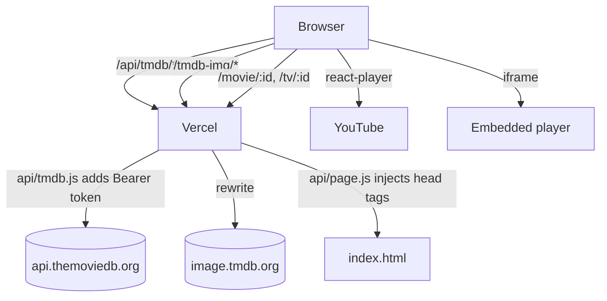

# Movix: Project Documentation

> A responsive movie and TV discovery app built with **React 18**, **Redux Toolkit**, **Vite** and **SASS**, powered by the **TMDB API** through a same-origin proxy on **Vercel**.

This is the technical reference for the codebase: what the app does, how it is wired together, how it reaches TMDB, how it is secured and optimised for search, and what is still open. For a short introduction, see [`README.md`](./README.md).

| | |
|---|---|
| **Repository** | https://github.com/satish-kumar75/Movix |
| **Live site** | https://movix-75.vercel.app |
| **Package** | `movix` (private), ES modules, Node 24 (`engines`) |
| **Dev server** | `npm run dev` → http://localhost:5173 |
| **Hosting** | Vercel: static Vite build plus serverless functions in `api/` |

---

## Table of contents

1. [What the app does](#1-what-the-app-does)
2. [Tech stack](#2-tech-stack)
3. [Getting started](#3-getting-started)
4. [Environment variables](#4-environment-variables)
5. [Project structure](#5-project-structure)
6. [Architecture](#6-architecture)
7. [Routing](#7-routing)
8. [TMDB access: proxy and serverless functions](#8-tmdb-access-proxy-and-serverless-functions)
9. [State management](#9-state-management)
10. [Pages and components](#10-pages-and-components)
11. [Video playback](#11-video-playback)
12. [SEO](#12-seo)
13. [Security](#13-security)
14. [Design system](#14-design-system)
15. [Scripts and deployment](#15-scripts-and-deployment)
16. [Open issues](#16-open-issues)
17. [Roadmap ideas](#17-roadmap-ideas)
18. [Credits and legal](#18-credits-and-legal)

---

## 1. What the app does

There is no login, backend database or user data. Everything is read live from TMDB.

| Capability | Where it lives |
|---|---|
| Hero banner of **upcoming movies** with a clickable poster strip | `pages/home/heroBanner` |
| **Trending** (day / week), **What's Popular** and **Top Rated** (movies / TV) carousels | `pages/home/*` |
| **Details** for a movie or TV show: poster, tagline, genres, rating, overview, status, dates, runtime, director, writers, creators | `pages/details` |
| **Top cast**, linking to person pages | `pages/details/cast`, `pages/person` |
| **Official videos** in a YouTube modal; **Watch Movie / TV Show** in an embedded player | `pages/details/VideosSection`, `components/vidSrcPlayer` |
| **Similar** titles and **Recommendations** carousels | `pages/details/carousels` |
| **Person page**: photo, biography with read more, birth data, aliases, social links, acting and production credits | `pages/person` |
| **Explore** movies or TV with genre multi-select, sorting and infinite scroll | `pages/explore` |
| **Search** across movies and TV with infinite scroll | `pages/searchResult` |
| **Where to Watch** strip under the rating row: provider logos for Stream, Free, Free with ads, Rent and Buy, a country picker (auto-detected, remembered) and JustWatch credit | `components/whereToWatch` |
| **Free legal download** (Download and Watch free) for public-domain classics, from the Internet Archive's curated collection | `api/archive.js`, `components/whereToWatch` |
| **Languages:** language and age rating on the details page, trailers filterable by language, and an original-language filter on Explore | `pages/details`, `pages/explore` |
| **My List:** bookmark button, `/my-list` page and a header badge, saved in the browser | `store/listSlice.js`, `pages/myList` |
| **TV seasons and episodes** with stills, air dates, runtimes and ratings | `pages/details/seasons` |
| **IMDb, Letterboxd and TMDB links**, and a "More from <collection>" carousel | `pages/details` |
| **About** and **Privacy** pages | `pages/about`, `pages/privacy` |
| Animated **404** page with a trending row; invalid movie, TV and person ids show it too | `pages/404` |

---

## 2. Tech stack

| Layer | Library | Role |
|---|---|---|
| UI | `react`, `react-dom` 18 | Rendering |
| Routing | `react-router-dom` 6 | Client-side routes; real `<Link>`s for crawlability |
| State | `@reduxjs/toolkit`, `react-redux` | Image base URLs and genre map |
| HTTP | `axios` | Calls to the same-origin proxy |
| Styling | `sass` | Per-component SCSS, shared mixins |
| Dates | `dayjs` | Formatting |
| Select | `react-select` | Explore filters |
| Infinite scroll | `react-infinite-scroll-component` | Explore and Search |
| Images | `react-lazy-load-image-component` | Blur-up lazy loading |
| Rating ring | `react-circular-progressbar` | Vote average badge |
| Video | `react-player` | YouTube trailers |
| Icons | `react-icons` | UI icons |
| Build | `vite`, `@vitejs/plugin-react` | Dev server and bundler |
| Lint | `eslint` 8 and React plugins | `npm run lint` |

Serverless functions in `api/` use plain Node (`fetch`), with no extra dependencies.

---

## 3. Getting started

**Prerequisites:** Git, Node.js 20 or newer (24 on Vercel) and npm.

```bash
git clone https://github.com/satish-kumar75/Movix.git
cd Movix
npm install
cp .env.example .env
```

Fill in `.env` (see below), then:

```bash
npm run dev       # Vite dev server with HMR
npm run build     # production build into dist/
npm run preview   # serve the build locally
npm run lint      # ESLint
```

**TMDB token:** create a free account at https://www.themoviedb.org, open **Settings → API** and copy the **API Read Access Token** (the long JWT, not the short v3 key).

**Local development on a blocked network:** the dev server proxies `/api` and `/tmdb-img` to the URL in `PROXY_TARGET`, which should be your deployed Vercel site. The proxy has to run somewhere that can reach TMDB, so `PROXY_TARGET` must point at the deployment, not at `localhost`.

---

## 4. Environment variables

| Variable | Read by | Purpose |
|---|---|---|
| `VITE_APP_TMDB_TOKEN` | `api/tmdb.js`, `api/page.js`, `api/sitemap.js` (server only) | TMDB Read Access Token, sent as a `Bearer` header. No browser code references it, so it is not in the bundle. |
| `VITE_APP_VIDSRC_URL` | `src/components/vidSrcPlayer` (browser) | Base URL of the embedded player; the iframe source is `${VITE_APP_VIDSRC_URL}/${mediaType}/${tmdbId}` |
| `PROXY_TARGET` | `vite.config.js` (dev only) | Deployed site that the dev server forwards `/api` and `/tmdb-img` to |

`.env`, `.env.*` and `*.pem` are git-ignored (except `.env.example`). On Vercel, set the first two under **Project → Settings → Environment Variables** and redeploy, since values are applied per deployment.

---

## 5. Project structure

```
Movix/
├── api/                        # Vercel serverless functions
│   ├── tmdb.js                 # TMDB proxy (GET only, path allowlist)
│   ├── archive.js              # Internet Archive lookup (curated public-domain collection only)
│   ├── page.js                 # Per-title head tags + JSON-LD for /movie/:id and /tv/:id
│   └── sitemap.js              # Dynamic /sitemap.xml
├── public/
│   ├── robots.txt
│   ├── banner.png              # Default social image
│   └── movix-logo.png          # Favicon and touch icon
├── index.html                  # Default meta, Open Graph, Twitter, WebSite JSON-LD, noscript
├── vercel.json                 # Rewrites, security headers, image caching
├── vite.config.js              # React plugin and dev proxy
├── .env.example
└── src/
    ├── main.jsx, App.jsx       # Root and routes
    ├── index.scss, mixins.scss # Tokens, reset, selection and focus styles, breakpoints
    ├── assets/                 # Logos (incl. tmdb-logo.png), avatar, fallbacks
    ├── hooks/
    │   ├── useFetch.jsx        # { data, loading, error }
    │   └── useSeo.jsx          # Title, description, canonical, Open Graph, robots per page
    ├── utils/
    │   ├── api.js              # Axios client for /api/tmdb and /api/archive with an in-memory cache
    │   └── region.js           # Country detection and saving, region and language display names
    ├── store/                  # Redux store; "home" slice and "list" slice (My List, persisted)
    ├── components/             # carousel, circleRating, contentWrapper, footer, genres, header,
    │                           # lazyLoadImage, moiveCard, spinner, switchTabs, videoPopup, vidSrcPlayer,
    │                           # whereToWatch
    └── pages/                  # home, details (cast, seasons, VideosSection, carousels), person,
                                # explore, searchResult, myList, about, privacy, 404
```

---

## 6. Architecture



The browser only ever talks to Movix's own domain for TMDB data and images. This is what makes the site work on networks that block TMDB's hosts (the symptom is a "CORS error", but TMDB itself sends correct CORS headers; the request is simply blocked).

**Boot sequence:** `main.jsx` renders `<App />` inside the Redux provider. `App.jsx` dispatches the image base URLs (`backdrop: /tmdb-img/w1280`, `poster: /tmdb-img/w500`, `profile: /tmdb-img/w342`) and fetches the movie and TV genre lists into one `{ [id]: { id, name } }` map.

**Data fetching:** `useFetch(url)` for read-only data; `fetchDataFromApi(url, params)` for paginated data in Explore and Search. The client cache is a module-level object keyed by URL and params; failures are not cached.

---

## 7. Routing

| Path | Component | Notes |
|---|---|---|
| `/` | `Home` | Hero, Trending, Popular, Top Rated |
| `/movie/:id`, `/tv/:id` | `Details` | The media type comes from the path; a TMDB 404 renders `PageNotFound` |
| `/search/:query` | `SearchResult` | `noindex` |
| `/explore/:mediaType` | `Explore` | `movie` or `tv` |
| `/person/:personId` | `Person` | A TMDB 404 renders `PageNotFound` |
| `/my-list` | `MyList` | Saved titles from local storage; `noindex` |
| `/about`, `/privacy` | `About`, `Privacy` | Static content |
| `*` | `PageNotFound` | `noindex` |

`vercel.json` rewrites, in order: the TMDB proxy, the image proxy, `/sitemap.xml` to `api/sitemap`, `/(movie|tv)/<digits>` to `api/page` (so title pages get real head tags), and finally any path without a dot to `/` (the SPA fallback). Paths with a dot, such as a missing `/favicon.ico`, return a real 404 instead of the app shell.

---

## 8. TMDB access: proxy and serverless functions

### 8.1 Client (`src/utils/api.js`)

`fetchDataFromApi(url, params)` calls `axios.get("/api/tmdb" + url, { params })`. On failure it returns TMDB's error body (`err.response.data`, for example `{ status_code: 34 }` for "not found") instead of throwing, and does not cache it. `Details` and `Person` check `status_code === 34` to show the 404 page.

### 8.2 `api/tmdb.js`

- Accepts `GET` only (`405` otherwise).
- Forwards only paths matching `^(movie|tv|person|search|discover|trending|genre|collection|watch)(/[A-Za-z0-9_]+)*$`, which blocks traversal such as `movie/../../account` and any account endpoint.
- Adds `Authorization: Bearer <VITE_APP_TMDB_TOKEN>` server-side and forwards query parameters.
- Retries once on a network error or a TMDB 5xx response, then returns `502` if TMDB is still unreachable.
- Caches successful responses at the edge for an hour (`s-maxage=3600`, `stale-while-revalidate`), and sets `no-store` on errors.

### 8.3 Endpoints used

| Endpoint | Used by |
|---|---|
| `/genre/{movie\|tv}/list` | `App`, `Explore` |
| `/movie/upcoming` | `HeroBanner` |
| `/trending/all/{day\|week}` | `Trending`, `About`, `PageNotFound` |
| `/{movie\|tv}/popular`, `/{movie\|tv}/top_rated` | Home rails |
| `/{movie\|tv}/{id}`, `/credits`, `/similar`, `/recommendations` | Details |
| `/{movie\|tv}/{id}/videos` (default, and with `include_video_language=...`) | Details, `VideosSection` |
| `/{movie\|tv}/{id}/watch/providers` | `WhereToWatch` |
| `/movie/{id}/release_dates`, `/tv/{id}/content_ratings` | Age rating on the details page |
| `/tv/{id}/external_ids` | IMDb link for TV |
| `/tv/{id}/season/{n}` | `Seasons` |
| `/collection/{id}` | `Collection` carousel |
| `/discover/{movie\|tv}` | `Explore` |
| `/search/multi` | `SearchResult` |
| `/person/{id}`, `/movie_credits`, `/external_ids` | Person |

### 8.3a Internet Archive lookup (`api/archive.js`)

`GET /api/archive?title=&original=&year=` searches the Internet Archive for an item in its **curated `feature_films` collection** with the same year and a title that starts with the movie's title (or original title). It returns `{ identifier }` or `{}`. The client only asks for movies released in 1995 or earlier.

Why only the curated collection: the Archive's user-upload areas contain copyrighted films, some wrongly tagged as public domain or CC0, so license tags are not trusted. Tested: Night of the Living Dead (1968) and Nosferatu (1922) match; Fight Club (1999), Charade and TV shows return nothing.

### 8.4 Images

`/tmdb-img/:path*` is rewritten to `https://image.tmdb.org/t/p/:path*` and served with `Cache-Control: public, max-age=31536000, immutable`. Sizes are `w1280` (backdrops), `w500` (posters), `w342` (profiles), `w300` (episode stills), `w92` (provider logos) and `w780` (social images).

### 8.5 Other network calls

YouTube (`react-player`, plus thumbnails from `img.youtube.com`), the embedded player (`VITE_APP_VIDSRC_URL`) and outbound social links on person pages.

---

## 9. State management

Two slices:

- `home` (`src/store/homeSlice.js`): `url` (`{ backdrop, poster, profile, still, logo }`, set by `getApiConfiguration`) and `genres` (id → genre).
- `list` (`src/store/listSlice.js`): `items`, the My List entries (`id`, `media_type`, title or name, poster, vote average, genre ids, release date). It loads from `localStorage` (`movix-list`) at startup, and `store.js` writes it back when it changes.

The chosen watch country is kept in `localStorage` (`movix-region`) by `utils/region.js`. Everything else is local component state.

---

## 10. Pages and components

**Home:** `HeroBanner` (the active slide's title is the page `<h1>`, the others are `<h2>`), then three carousel sections with `SwitchTabs`.

**Details:** `DetailsBanner` (sets the page title, description and image through `useSeo`; the trailer button only appears when TMDB has a video), then in this order: `Cast`, `Seasons` (TV only), `VideosSection`, `Collection` (movies in a collection), `SimilarMovies`, `Recommendations`. Empty sections are hidden, and a TMDB "not found" response shows the 404 page.

Directly under the rating and trailer buttons, `DetailsBanner` renders **Where to Watch** and a row of pills (Add to My List, IMDb, Letterboxd for movies, TMDB). The info list adds **Language** (spoken languages) and **Rated** (age rating for the visitor's country, falling back to the US).

**Where to Watch (`components/whereToWatch`):** reads `/watch/providers`, lists the countries TMDB has data for in a picker, and starts from the saved country, then the browser language region, then US. Logos link to TMDB's watch page for that country (TMDB does not expose per-provider deep links). It shows a skeleton while loading, nothing if there is no data at all, and a short note if the title is not listed in the chosen country. JustWatch is credited.

**VideosSection:** requests videos in 25 languages and shows language chips (All, English, Tamil, ...) when more than one language exists.

**Seasons:** season chips (including Specials), the first 8 episodes of the chosen season with a "Show all" toggle, and lazy-loaded episode stills.

**Person:** `PersonDetails` and two credit carousels, with page metadata from the person's name and biography.

**Explore:** an intro sentence, genre, language and sort selects, infinite scroll, and a helpful empty state. The language filter maps to TMDB's `with_original_language`. For TV, release-date and title sorts are translated to `first_air_date` and `original_name`.

**My List:** the saved grid (reusing `MovieCard`), a count, "Clear list", an empty state with links, and a `noindex` tag. The header shows a count badge.

**Search:** `noindex` results with a helpful empty state and links to browse instead. The query is URL-encoded and sent as a request parameter, and a new search always starts at page 1.

**About:** real trending posters fanned in the hero, a hairline feature list, a rating-ring legend built from the real `CircleRating` component, the TMDB attribution with logo, the video disclaimer, the tech stack and a contact call to action.

**Privacy:** a plain-language policy with a sticky contents list. It states what the code actually does: no accounts, no analytics or ad trackers, TMDB reached through the proxy, Vercel hosting logs, and the third-party services (YouTube, the embedded player, TMDB, social links).

**404:** a spinning film reel in the "0", staggered text, three navigation buttons and a "Trending this week" carousel. Motion respects `prefers-reduced-motion`.

**Shared:** `Header` (hide-on-scroll, search, mobile menu, real links), `Footer` (description, TMDB attribution and logo, GitHub link, About and Privacy), `Carousel`, `MovieCard` and `Cast` (all real links with image alt text), `CircleRating`, `Geners`, `Img`, `SwitchTabs`, `Spinner`, `VideoPopup`, `VidSrcPlayer`.

---

## 11. Video playback

1. **Trailers and clips:** TMDB `/videos` returns YouTube keys; `VideoPopup` plays them with `react-player`.
2. **Watch Movie / TV Show:** `VidSrcPlayer` loads `${VITE_APP_VIDSRC_URL}/${mediaType}/${id}` in an iframe with a minimal `allow` list (`autoplay; encrypted-media; picture-in-picture; fullscreen`). The iframe is only mounted while the modal is open, so closing it stops playback.

**Sandboxing is not possible with this provider.** Tested directly: with a `sandbox` attribute the player refuses to load ("This content can't be embedded in a sandboxed frame"). The provider also needs the default referrer, since `referrerpolicy="no-referrer"` and `"origin"` both break playback. The CSP therefore allows `frame-src https:` so that changing the provider URL does not require a code change.

Movix does not host any video. The embedded service is third-party; the site owner is responsible for making sure that what it serves is lawful where the site is available.

---

## 12. SEO

| Area | Implementation |
|---|---|
| Default metadata | `index.html`: title, description, robots, Open Graph, Twitter card, theme color, `WebSite` JSON-LD, correct favicon type, a `noscript` message |
| Per-page metadata in the browser | `useSeo({ title, description, image, noindex, type })` sets title, description, canonical, robots, Open Graph and Twitter tags. It is called by every page. Search, 404 and invalid Explore types are `noindex`. |
| Metadata in the raw HTML | `api/page.js` handles `/movie/:id` and `/tv/:id`: it fetches the title from TMDB, replaces the head tags in `index.html` (title, description, robots, canonical, Open Graph, Twitter, JSON-LD) and adds `Movie` or `TVSeries` JSON-LD with `aggregateRating` when votes exist. WhatsApp, X, Slack and crawlers that do not run JavaScript see real data. A TMDB 404 returns a real `404` with `noindex`. Arguments are validated, and HTML and JSON-LD output are escaped. |
| Sitemap | `api/sitemap.js` serves `/sitemap.xml`: home, Explore, About, Privacy and the movie and TV detail pages from three pages each of TMDB's popular and top-rated lists (about 240 URLs). The host comes from the request, and it is cached for a day. |
| `robots.txt` | Allows everything except `/api/`, and points to the sitemap |
| Crawlable links | Cards, cast, hero button, logo, menu and footer are `<a href>` links |
| Content | Unique titles and descriptions, alt text on images, one `<h1>` per page, `<h2>` section headings, intro text on Explore, About and Privacy |
| Errors | Missing files return a real 404; invalid media types and ids show the 404 page |

**Hard-coded domain:** `https://movix-75.vercel.app` appears in `public/robots.txt` and the static tags in `index.html`. Update both if you add a custom domain; the server functions use the request host.

**Social image:** `banner.png` is about 1.2 MB, which is fine for Facebook and X but may be skipped by WhatsApp. A version under 300 KB would help.

**Limit:** the app is still client-rendered. Explore, Person and Home get their per-page metadata from JavaScript, which Google renders but other crawlers may not.

---

## 13. Security

| Control | Detail |
|---|---|
| Secrets | `.env` files are git-ignored and untracked; `.env.example` documents the names. The TMDB token is read only by serverless functions. |
| Proxy hardening | GET only, path allowlist, no traversal, validated arguments, `no-store` on errors |
| Headers (`vercel.json`) | `Content-Security-Policy`, `X-Content-Type-Options: nosniff`, `Referrer-Policy: strict-origin-when-cross-origin`, `X-Frame-Options: SAMEORIGIN`, `Permissions-Policy` (camera, microphone, geolocation, payment, usb off). HSTS is added by Vercel. |
| CSP | `default-src 'self'`; scripts from self and YouTube; styles self plus inline (react-select needs it); images from self, `data:`, `blob:` and YouTube image hosts; `connect-src 'self'`; `frame-src https:`; `object-src 'none'`; `base-uri`, `form-action` and `frame-ancestors` restricted; `upgrade-insecure-requests` |
| Dependencies | `npm audit fix` applied; 5 advisories remain and need major upgrades (see below) |
| Output escaping | HTML attributes and JSON-LD escaped in `api/page.js`; React escapes everything else |
| Privacy | No analytics, accounts or tracking by Movix. The proxy means TMDB sees the server, not the visitor. Only two things are saved, on the visitor's own device: My List and the chosen country. |
| Legal sources only | Availability comes from JustWatch through TMDB; free downloads come only from the Internet Archive's curated collection. No scraped or third-party download links. |

**Rotate the TMDB token.** It was committed to git in the past and remains in history. Create a new token in TMDB, set it in Vercel and your local `.env`.

---

## 14. Design system

A dark, cinematic navy theme with an orange → pink accent, defined in `src/index.scss`.

| Token | Value |
|---|---|
| `--black` / `--black2` / `--black3` | `#04152d` / `#041226` / `#020c1b` |
| `--black-light` / `--black-lighter` | `#173d77` / `#1c4b91` |
| `--pink` / `--orange` | `#da2f68` / `#f89e00` |
| `--gradient` | `linear-gradient(98.37deg, #f89e00 0.99%, #da2f68 100%)` |

- **Typography:** `Inter, Avenir, Helvetica, Arial, sans-serif`, 16px, weight 500. No font files are loaded, so the system fallback is what most visitors see.
- **Layout:** `.contentWrapper` is 1200px; breakpoint mixins `sm` 640, `md` 768, `lg` 1024, `xl` 1280, `xxl` 1536 (mobile first); `ellipsis()` mixin.
- **Global:** `h1, h2, h3 { font: inherit }` and `a { color: inherit; text-decoration: none }` keep semantic tags looking the way they did; text selection is pink; keyboard focus uses an orange outline; scrollbars are hidden.
- **Motion:** skeleton shimmer, spinner, hero slide, tab indicator, header slide, blur-up images, the About poster fan, and the 404 reel and text reveal. Reduced-motion preferences are respected on the new pages.
- **Rating colors:** red below 5, orange below 7, green from 7.

---

## 15. Scripts and deployment

| Script | Command |
|---|---|
| `dev` | `vite --host` |
| `build` | `vite build` |
| `preview` | `vite preview` |
| `lint` | `eslint . --ext js,jsx --report-unused-disable-directives --max-warnings 0` |

**Deploying to Vercel:** import the repo (Vite preset, output `dist`), add `VITE_APP_TMDB_TOKEN` and `VITE_APP_VIDSRC_URL`, and deploy. `package.json` pins Node 24. Pushing to `main` redeploys.

After a deploy, check: `/api/tmdb/movie/upcoming` returns JSON, `/tmdb-img/w500/<poster>` returns an image, `/robots.txt` and `/sitemap.xml` load, `/movie/550` has its own title in the page source, and a junk URL such as `/favicon.ico` returns a 404.

---

## 16. Open issues

**Fixed in the latest passes** (including TV dates on cards and carousels, the Explore TV sort, the not-found crash on invalid ids and a request race in `useFetch`): the TMDB block and CORS symptom, the exposed token, committed `.env`, TV release dates on the details page, API errors treated as data, the trailer crash on titles with no videos, the embedded player continuing after Close, skeletons that never rendered, search query encoding and paging, the blank 404, dead footer links and lorem ipsum, missing TMDB attribution, debug logging, image sizes, and the missing SEO basics.

**Still open:**

1. **Embedded player.** A third-party service that cannot be sandboxed (section 11).
2. **Five npm advisories** remain: esbuild/Vite (dev server only, fix is Vite 8) and React Router (fix is v7). Both are breaking upgrades.
3. **Explore:** `filters` is a module-level mutable object.
4. **Where to Watch limits.** TMDB gives no per-service audio or dub languages and no per-provider deep links, so logos open TMDB's watch page for the country.
5. **Sparse data:** `vote_average.toFixed` and `genre_ids.slice` assume the fields exist; hero and backdrop images assume `backdrop_path` is not null.
6. **Person credits** can repeat a title (duplicate React keys), and the two person carousels sort the cached response in place.
7. **Header** scroll listener resubscribes on every scroll position change.
8. **Naming typos** in paths and identifiers: `moiveCard`, `Geners`, `generesCall`.
9. **No tests, TypeScript or PropTypes**; many files disable lint rules, and `npm run lint` fails on pre-existing unused imports.
10. **Accessibility:** clickable `div`s for modals and tabs, no focus management in the video modal.

---

## 17. Roadmap ideas

- Server-render or pre-render the remaining routes, or move to a framework with SSR.
- Smaller social image and a self-hosted display font.
- Watchlist in `localStorage`, debounced search suggestions, TV season and episode browser.
- Replace the hand-rolled cache with React Query or RTK Query.
- TypeScript and Vitest tests for `useFetch`, `api.js` and the proxy functions.

---

## 18. Credits and legal

- Movie, TV and person data and images are provided by **[TMDB](https://www.themoviedb.org)**. *This product uses the TMDB API but is not endorsed or certified by TMDB.* Review TMDB's [API terms of use](https://www.themoviedb.org/api-terms-of-use).
- Trailers play from **YouTube**.
- Streaming availability data is provided by **JustWatch** through TMDB. Free downloads link to the **Internet Archive**.
- Full-length playback comes from an external embed provider configured through `VITE_APP_VIDSRC_URL`. Movix hosts no video.
- Icons: `react-icons`. The TMDB mark in the footer and About page is TMDB's own.
