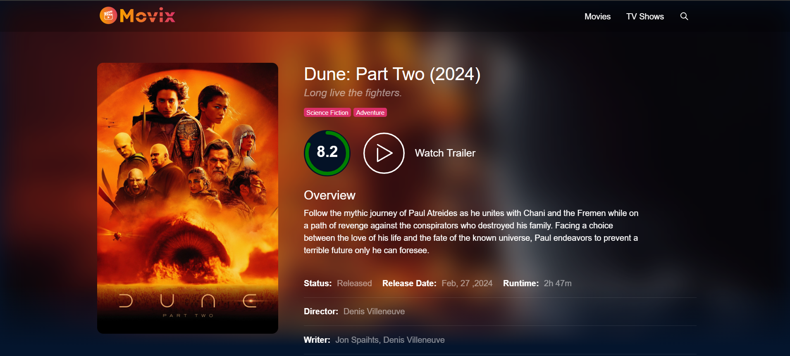

<div align="center">
  <br />
      
  <br />

  <div>
    
    
    
    
  </div>

  <h3 align="center">Movix</h3>

</div>

## 📋 <a name="table">Table of Contents</a>

1. 🤖 [Introduction](#introduction)
2. ⚙️ [Tech Stack](#tech-stack)
3. 🔋 [Features](#features)
4. 🤸 [Quick Start](#quick-start)
5. 🕸️ [Snippets](#snippets)
6. 🔗 [Links](#links)

## <a name="introduction">🤖 Introduction</a>

I developed a stunning, fully responsive movie website using the TMDB API and React. It features a dynamic Home page for popular and trending movies, detailed movie pages with trailers and cast info, and an Explore section with infinite scrolling.

## <a name="tech-stack">⚙️ Tech Stack</a>

- React.js
- Redux Toolkit
- Vite
- SASS

## <a name="features">🔋 Features</a>

👉 **Dynamic Home Page**: Showcases popular and trending movies with lazy-loaded images and interactive carousels.

👉 **Detailed Movie Pages**: Includes comprehensive information, cast details, trailers, and video clips using a React video player.

👉 **Cast Biographies and Filmographies**: Users can explore detailed biographies and filmographies by clicking on cast images.

👉 **Explore Section**: Allows users to discover movies and TV series with enhanced infinite scrolling using react-infinite-scroll-component.

👉 **Completely Responsive**: Ensures consistent access and optimal viewing on any device with a fully responsive design.

👉 **Global State Management with Redux**: Efficient state management across the entire application.

## <a name="quick-start">🤸 Quick Start</a>

Follow these steps to set up the project locally on your machine.

**Prerequisites**

Make sure you have the following installed on your machine:

- [Git](https://git-scm.com/)
- [Node.js](https://nodejs.org/en)
- [npm](https://www.npmjs.com/) (Node Package Manager)

**Cloning the Repository**

```bash
git clone https://github.com/satish-kumar75/Movix.git
cd Movix
```

**Installation**

Install the project dependencies using npm:

```bash
npm install
```

**Running the Project**

```bash
npm run dev
```

Open [http://localhost:5173](http://localhost:5173) in your browser to view the project.

## <a name="snippets">🕸️ Snippets</a>

<details>
<summary><code>index.scss</code></summary>

```css
:root {
  font-family: Inter, Avenir, Helvetica, Arial, sans-serif;
  font-size: 16px;
  line-height: 1;
  font-weight: 500;

  font-synthesis: none;
  text-rendering: optimizeLegibility;
  -webkit-font-smoothing: antialiased;
  -moz-osx-font-smoothing: grayscale;
  -webkit-text-size-adjust: 100%;

  --black: #04152d;
  --black2: #041226;
  --black3: #020c1b;
  --black-lighter: #1c4b91;
  --black-light: #173d77;
  --pink: #da2f68;
  --orange: #f89e00;
  --gradient: linear-gradient(98.37deg, #f89e00 0.99%, #da2f68 100%);
}

* {
  margin: 0;
  padding: 0;
  box-sizing: border-box;
}

body {
  background-color: var(--black);
}

::-webkit-scrollbar {
  display: none;
}

.skeleton {
  position: relative;
  overflow: hidden;
  background-color: #0a2955;
  &::after {
    position: absolute;
    top: 0;
    right: 0;
    bottom: 0;
    left: 0;
    transform: translateX(-100%);
    background-image: linear-gradient(
      90deg,
      rgba(#193763, 0) 0,
      rgba(#193763, 0.2) 20%,
      rgba(#193763, 0.5) 60%,
      rgba(#193763, 0)
    );
    animation: shimmer 2s infinite;
    content: "";
  }

  @keyframes shimmer {
    100% {
      transform: translateX(100%);
    }
  }
}
```

</details>

<details>
<summary><code>Img.jsx</code></summary>

```javascript
import React from "react";
import { LazyLoadImage } from "react-lazy-load-image-component";
import "react-lazy-load-image-component/src/effects/blur.css";

const Img = ({ src, className }) => {
  return (
    <LazyLoadImage className={className || ""} alt="" effect="blur" src={src} />
  );
};

export default Img;
```

</details>

<details>
<summary><code>mixins.scss</code></summary>

```css
@mixin sm {
  @media only screen and (min-width: 640px) {
    @content;
  }
}

@mixin md {
  @media only screen and (min-width: 768px) {
    @content;
  }
}

@mixin lg {
  @media only screen and (min-width: 1024px) {
    @content;
  }
}

@mixin xl {
  @media only screen and (min-width: 1280px) {
    @content;
  }
}

@mixin xxl {
  @media only screen and (min-width: 1536px) {
    @content;
  }
}

@mixin ellipsis($line: 2) {
  display: -webkit-box;
  -webkit-line-clamp: $line;
  -webkit-box-orient: vertical;
  overflow: hidden;
  text-overflow: ellipsis;
}
```

</details>

<details>
<summary><code>useFetch.jsx</code></summary>

```javascript
import { useEffect, useState } from "react";
import { fetchDataFromApi } from "../utils/api";
const useFetch = (url) => {
  const [data, setData] = useState(null);
  const [loading, setLoading] = useState(null);
  const [error, setError] = useState(null);

  useEffect(() => {
    setLoading("loading...");
    setData(null);
    setError(null);

    fetchDataFromApi(url)
      .then((res) => {
        setLoading(false);
        setData(res);
      })
      .catch((err) => {
        setLoading(false);
        setError("Something went wrong!");
      });
  }, [url]);

  return { data, loading, error };
};

export default useFetch;
```

</details>

<details>
<summary><code>package.json</code></summary>

```json
"dependencies": {
    "@reduxjs/toolkit": "^1.9.1",
    "axios": "^1.2.2",
    "dayjs": "^1.11.7",
    "react": "^18.2.0",
    "react-circular-progressbar": "^2.1.0",
    "react-dom": "^18.2.0",
    "react-icons": "^4.7.1",
    "react-infinite-scroll-component": "^6.1.0",
    "react-lazy-load-image-component": "^1.5.6",
    "react-player": "^2.11.0",
    "react-redux": "^8.0.5",
    "react-router-dom": "^6.6.2",
    "react-select": "^5.7.0",
    "sass": "^1.57.1"
  }
```

</details>

<details>
<summary><code>PlayIcon.jsx</code></summary>

```javascript
export const PlayIcon = () => {
  return (
    <svg
      version="1.1"
      xmlns="http://www.w3.org/2000/svg"
      xmlnsXlink="http://www.w3.org/1999/xlink"
      x="0px"
      y="0px"
      width="80px"
      height="80px"
      viewBox="0 0 213.7 213.7"
      enableBackground="new 0 0 213.7 213.7"
      xmlSpace="preserve"
    >
      <polygon
        className="triangle"
        fill="none"
        strokeWidth="7"
        strokeLinecap="round"
        strokeLinejoin="round"
        strokeMiterlimit="10"
        points="73.5,62.5 148.5,105.8 73.5,149.1 "
      ></polygon>
      <circle
        className="circle"
        fill="none"
        strokeWidth="7"
        strokeLinecap="round"
        strokeLinejoin="round"
        strokeMiterlimit="10"
        cx="106.8"
        cy="106.8"
        r="103.3"
      ></circle>
    </svg>
  );
};
```

</details>

<details>
<summary><code>Spinner.jsx</code></summary>

```javascript
import React from "react";

import "./style.scss";

const Spinner = ({ initial }) => {
    return (
        <div className={`loadingSpinner ${initial ? "initial" : ""}`}>
            <svg className="spinner" viewBox="0 0 50 50">
                <circle
                    className="path"
                    cx="25"
                    cy="25"
                    r="20"
                    fill="none"
                    strokeWidth="5"
                ></circle>
            </svg>
        </div>
    );
};

export default Spinner;

// CSS
.loadingSpinner {
    width: 100%;
    height: 150px;
    position: relative;
    display: flex;
    align-items: center;
    justify-content: center;
    .spinner {
        animation: rotate 2s linear infinite;
        z-index: 2;
        width: 50px;
        height: 50px;
        & .path {
            stroke: hsl(210, 70, 75);
            stroke-linecap: round;
            animation: dash 1.5s ease-in-out infinite;
        }
    }

    &.initial {
        height: 700px;
    }

    @keyframes rotate {
        100% {
            transform: rotate(360deg);
        }
    }

    @keyframes dash {
        0% {
            stroke-dasharray: 1, 150;
            stroke-dashoffset: 0;
        }
        50% {
            stroke-dasharray: 90, 150;
            stroke-dashoffset: -35;
        }
        100% {
            stroke-dasharray: 90, 150;
            stroke-dashoffset: -124;
        }
    }
}
```

</details>

## <a name="links">🔗 Links</a>

Public Assets used in the project can be found [here](https://drive.google.com/file/d/1W1Z8rPPZ4w7clT5jPxzeHkZYhaPJBPIy/view)
